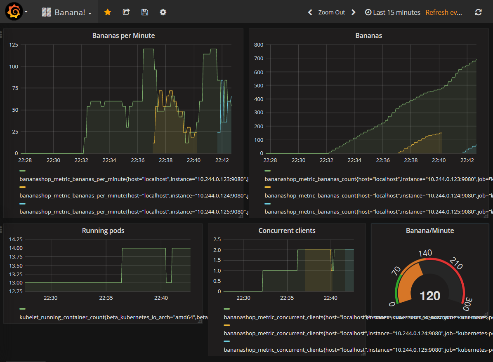
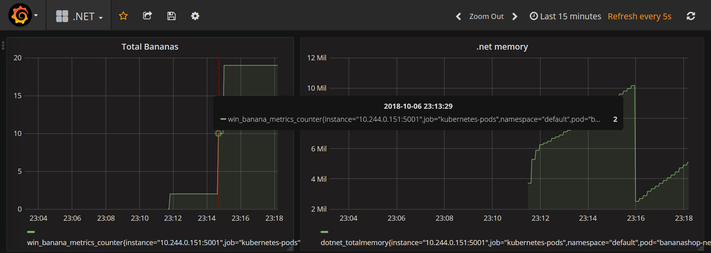

# Table of contents

- autoscalerServerWLP: Websphere Liberty server application + docker file (build and run)
- autoscalerServerNet: .Net Core 2.0 server application + docker file (build and run)
- autoscalerClient: simple VB.NET demo client for WLP (you can use the web interface of .Net o WLP service)
- kubernetes: deployment files for Java and .Net application + dashboard

autoscalerServerWLP and autoscalerServerNet contains the needed Dockerfile to compile the source code and create a the local image.

# Installation
## Kubernetes node (based on Debian 9)

Install Kubernetes

    apt update && apt install -y apt-transport-https curl
    curl -s https://packages.cloud.google.com/apt/doc/apt-key.gpg | apt-key add -
    cat <<EOF >/etc/apt/sources.list.d/kubernetes.list
    deb http://apt.kubernetes.io/ kubernetes-xenial main
    EOF
    apt update
    apt install -y kubelet kubeadm kubectl
    apt-mark hold kubelet kubeadm kubectl
    
Install Docker
    
    apt-get install apt-transport-https ca-certificates curl gnupg2 software-properties-common
    curl -fsSL https://download.docker.com/linux/debian/gpg | sudo apt-key add -
    add-apt-repository "deb [arch=amd64] https://download.docker.com/linux/debian $(lsb_release -cs) stable"
   
    apt update
    apt install docker-ce
   
    # List of images to pull
    kubeadm config images list

Install the master

    cat <<\EOF | tee kubeadm.yaml
    kind: MasterConfiguration
    apiVersion: kubeadm.k8s.io/v1alpha2
    networking:
      dnsDomain: cluster.local
      podSubnet: 10.244.0.0/16
      serviceSubnet: 10.96.0.0/12    
    controllerManagerExtraArgs:
        horizontal-pod-autoscaler-use-rest-clients: "true"
        horizontal-pod-autoscaler-sync-period: "10s"
        horizontal-pod-autoscaler-downscale-stabilization: "1m"
        node-monitor-grace-period: "10s"
    EOF
    kubeadm init --config kubeadm.yaml

    chmod 444 /etc/kubernetes/admin.conf
    cat <<\EOF | tee -a /etc/sysctl.conf 
    net.bridge.bridge-nf-call-iptables=1"
    EOF
    sysctl -p
    
    export KUBECONFIG=/etc/kubernetes/admin.conf
    kubectl taint nodes --all node-role.kubernetes.io/master-

1.12 compatible patched flannel

    kubectl apply -f https://raw.githubusercontent.com/coreos/flannel/bc79dd1505b0c8681ece4de4c0d86c5cd2643275/Documentation/kube-flannel.yml

Metric server (based on Prometheus)

    kubectl apply -f https://raw.githubusercontent.com/kubernetes-incubator/metrics-server/master/deploy/1.8%2B/auth-delegator.yaml
    kubectl apply -f https://raw.githubusercontent.com/kubernetes-incubator/metrics-server/master/deploy/1.8%2B/auth-reader.yaml
    kubectl apply -f https://raw.githubusercontent.com/kubernetes-incubator/metrics-server/master/deploy/1.8%2B/metrics-apiservice.yaml
    kubectl apply -f https://raw.githubusercontent.com/kubernetes-incubator/metrics-server/master/deploy/1.8%2B/metrics-server-deployment.yaml
    kubectl apply -f https://raw.githubusercontent.com/kubernetes-incubator/metrics-server/master/deploy/1.8%2B/metrics-server-service.yaml
    kubectl apply -f https://raw.githubusercontent.com/kubernetes-incubator/metrics-server/master/deploy/1.8%2B/resource-reader.yaml

    # Metric server
    sudo curl -s -L -o /bin/cfssl https://pkg.cfssl.org/R1.2/cfssl_linux-amd64
    sudo curl -s -L -o /bin/cfssljson https://pkg.cfssl.org/R1.2/cfssljson_linux-amd64
    sudo curl -s -L -o /bin/cfssl-certinfo https://pkg.cfssl.org/R1.2/cfssl-certinfo_linux-amd64
    sudo chmod +x /bin/cfssl*

    # TBD
    cat <<\EOF | sudo tee /etc/default/kubelet
    KUBELET_EXTRA_ARGS="--read-only-port=10255"
    EOF

    # Install Prometheus for custom-metrial-api server
    kubectl create namespace monitoring
    kubectl apply -f https://raw.githubusercontent.com/stefanprodan/k8s-prom-hpa/master/prometheus/prometheus-cfg.yaml
    kubectl apply -f https://raw.githubusercontent.com/stefanprodan/k8s-prom-hpa/master/prometheus/prometheus-dep.yaml
    kubectl apply -f https://raw.githubusercontent.com/stefanprodan/k8s-prom-hpa/master/prometheus/prometheus-rbac.yaml
    kubectl apply -f https://raw.githubusercontent.com/stefanprodan/k8s-prom-hpa/master/prometheus/prometheus-svc.yaml

    export PURPOSE=metrics
    export SECRET_FILE=cm-adapter-serving-certs.yaml
    openssl req -x509 -sha256 -new -nodes -days 365 -newkey rsa:2048 -keyout ${PURPOSE}-ca.key -out ${PURPOSE}-ca.crt -subj "/CN=ca"
	echo '{"signing":{"default":{"expiry":"43800h","usages":["signing","key encipherment","'${PURPOSE}'"]}}}' > "${PURPOSE}-ca-config.json"
    echo '{"CN":"custom-metrics-apiserver","hosts":["custom-metrics-apiserver.monitoring","custom-metrics-apiserver.monitoring.svc"],"key":{"algo":"rsa","size":2048}}' | cfssl gencert -ca=metrics-ca.crt -ca-key=metrics-ca.key -config=metrics-ca-config.json - | cfssljson -bare apiserver

	echo "apiVersion: v1" > ${SECRET_FILE}
	echo "kind: Secret" >> ${SECRET_FILE}
	echo "metadata:" >> ${SECRET_FILE}
	echo " name: cm-adapter-serving-certs" >> ${SECRET_FILE}
	echo " namespace: monitoring" >> ${SECRET_FILE}
	echo "data:" >> ${SECRET_FILE}
	echo " serving.crt: $(cat apiserver.pem | base64 -w 0)" >> ${SECRET_FILE}
	echo " serving.key: $(cat apiserver-key.pem | base64 -w 0)" >> ${SECRET_FILE}
    kubectl apply -f cm-adapter-serving-certs.yaml

    kubectl apply -f https://raw.githubusercontent.com/stefanprodan/k8s-prom-hpa/master/custom-metrics-api/custom-metrics-apiserver-auth-delegator-cluster-role-binding.yaml
    kubectl apply -f https://raw.githubusercontent.com/stefanprodan/k8s-prom-hpa/master/custom-metrics-api/custom-metrics-apiserver-auth-reader-role-binding.yaml
    kubectl apply -f https://raw.githubusercontent.com/stefanprodan/k8s-prom-hpa/master/custom-metrics-api/custom-metrics-apiserver-deployment.yaml
    kubectl apply -f https://raw.githubusercontent.com/stefanprodan/k8s-prom-hpa/master/custom-metrics-api/custom-metrics-apiserver-resource-reader-cluster-role-binding.yaml
    kubectl apply -f https://raw.githubusercontent.com/stefanprodan/k8s-prom-hpa/master/custom-metrics-api/custom-metrics-apiserver-service-account.yaml
    kubectl apply -f https://raw.githubusercontent.com/stefanprodan/k8s-prom-hpa/master/custom-metrics-api/custom-metrics-apiserver-service.yaml
    kubectl apply -f https://raw.githubusercontent.com/stefanprodan/k8s-prom-hpa/master/custom-metrics-api/custom-metrics-apiservice.yaml
    kubectl apply -f https://raw.githubusercontent.com/stefanprodan/k8s-prom-hpa/master/custom-metrics-api/custom-metrics-cluster-role.yaml
    kubectl apply -f https://raw.githubusercontent.com/stefanprodan/k8s-prom-hpa/master/custom-metrics-api/custom-metrics-resource-reader-cluster-role.yaml
    kubectl apply -f https://raw.githubusercontent.com/stefanprodan/k8s-prom-hpa/master/custom-metrics-api/hpa-custom-metrics-cluster-role-binding.yaml

    kubectl edit configmaps --namespace=monitoring prometheus-config
    # Change scrape interval to 5s

Grafana

    kubectl apply -f https://raw.githubusercontent.com/giantswarm/kubernetes-prometheus/master/manifests/grafana/deployment.yaml
    kubectl apply -f https://raw.githubusercontent.com/giantswarm/kubernetes-prometheus/master/manifests/grafana/service.yaml
    kubectl apply -f https://raw.githubusercontent.com/giantswarm/kubernetes-prometheus/master/manifests/grafana/import-dashboards/configmap.yaml
    kubectl apply -f https://raw.githubusercontent.com/giantswarm/kubernetes-prometheus/master/manifests/grafana/import-dashboards/job.yaml

Dashboard

    kubectl apply  -f https://raw.githubusercontent.com/kubernetes/dashboard/master/src/deploy/recommended/kubernetes-dashboard.yaml

# Build and install
## Java Application
### Build Docker image

This procecure use the multi-stage docker build to create the artifact with maven and inject the war file in the WLP base image:

    cd autoscalerServerWLP
    docker build --no-cache . -t angeloxx/bananashopwlp
    
### Install application

    kubectl apply -f kubernetes/website-wlp.yaml
    
## .NET Application
### Build Docker image

This procecure use the multi-stage docker build to create the artifact with dotnet-sdk and inject the obtained files in the dotnet base base image:

    cd autoscalerServerNet/BananaShopNet
    docker build --no-cache  . -t angeloxx/bananashopnet 
    
### Install application

    kubectl apply -f kubernetes/website-net.yaml

# Demo
## Useful command lines during the demo

    kubectl get horizontalpodautoscalers.autoscaling bananashop-app
    kubectl describe deployments bananashop-app

    kubectl get horizontalpodautoscalers.autoscaling bananashop-net
    kubectl describe deployments bananashop-net

## Sample Grafana dashboard

Java application

.NET application (banana counter and dotnet memory)

## Kubernetes status
#### When application is idle

    $ kubectl get horizontalpodautoscalers.autoscaling bananashop-app
    NAME             REFERENCE                   TARGETS   MINPODS   MAXPODS   REPLICAS   AGE
    bananashop-app   Deployment/bananashop-app   5/70      1         5         1          2d6h

#### Under pressure

    $ kubectl get horizontalpodautoscalers.autoscaling bananashop-app
    NAME             REFERENCE                   TARGETS   MINPODS   MAXPODS   REPLICAS   AGE
    bananashop-app   Deployment/bananashop-app   130/70    1         5         2          2d6h

## Read metrics via kubectl
#### Java

    $ kubectl get --raw "/apis/custom.metrics.k8s.io/v1beta1/namespaces/default/pods/*/bananashop_metric_bananas_per_minute" | jq .
    {
    "kind": "MetricValueList",
    "apiVersion": "custom.metrics.k8s.io/v1beta1",
    "metadata": {
        "selfLink": "/apis/custom.metrics.k8s.io/v1beta1/namespaces/default/pods/%2A/bananashop_metric_bananas_per_minute"
    },
    "items": [
        {
        "describedObject": {
            "kind": "Pod",
            "namespace": "default",
            "name": "bananashop-app-55c4c4d64-nwqrz",
            "apiVersion": "/__internal"
        },
        "metricName": "bananashop_metric_bananas_per_minute",
        "timestamp": "2018-10-07T10:09:27Z",
        "value": "0"
        }
    ]
    }

#### .NET

    $ kubectl get --raw "/apis/custom.metrics.k8s.io/v1beta1/namespaces/default/pods/*/win_banana_metrics_perminute" | jq .
    {
    "kind": "MetricValueList",
    "apiVersion": "custom.metrics.k8s.io/v1beta1",
    "metadata": {
        "selfLink": "/apis/custom.metrics.k8s.io/v1beta1/namespaces/default/pods/%2A/win_banana_metrics_perminute"
    },
    "items": [
        {
        "describedObject": {
            "kind": "Pod",
            "namespace": "default",
            "name": "bananashop-net-5f76598f9d-555dr",
            "apiVersion": "/__internal"
        },
        "metricName": "win_banana_metrics_perminute",
        "timestamp": "2018-10-07T10:10:31Z",
        "value": "0"
        }
    ]
    }

# References
- https://github.com/CPMoore/waslp-prometheusExporter
- https://github.com/prometheus-net/prometheus-net
- https://github.com/prometheus/jmx_exporter

## Usage of prometheudExported feature (Java)

Install the feature in your Webshere Liberty

    bin\featureManager install prometheusExporter-1.0.0.esa

and activate the feature on your server.xml, eg:

    <feature>restConnector-2.0</feature>
    <feature>usr:prometheusExporter-1.0</feature>

You can define the prometheus endpoint and the list of exposes metrics:

	<prometheusExporter lowercaseOutputLabelNames="true" lowercaseOutputName="true" path="/" startDelaySeconds="1">
        <blacklistObjectName>WebSphere:*</blacklistObjectName>
        <blacklistObjectName>waslp:*</blacklistObjectName>
        <connection addIdentificationLabels="true" baseURL="http://localhost:9081" includeMemberMetrics="true"/>
        <rule attrNameSnakeCase="true" help="Some help text" name="os_metric_$1" pattern="java.lang{type=OperatingSystem}{}(.*):" valueFactor="1"></rule>
        <rule attrNameSnakeCase="true" help="BananaShopMetrics" name="bananashop_metric_$1" pattern="com.angeloxx.bananashop{type=CounterMBean}{}(.*):"></rule>  
    </prometheusExporter>

The application Deployment annontation is used by Prometheus to know if (and where) scrape the pod for metrics:

      annotations:
        prometheus.io/scrape: "true"
        prometheus.io/path: "/prometheusExporter"
        prometheus.io/port: "9080"
        metrics.alpha.kubernetes.io/custom-endpoints: '{"path": "/prometheusExporter", "port": 9080, "names": ["bananashop_metric_bananas_count"]}'
